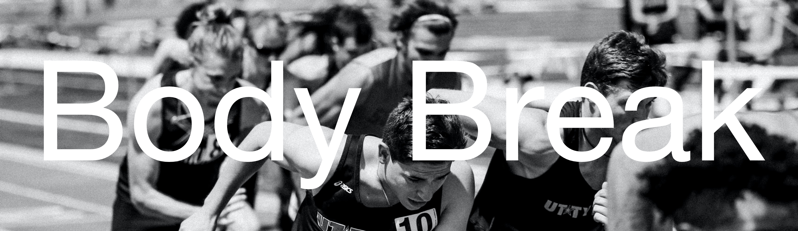

---

# **Project Description**

Built in July 2022 by [Ben Griffiths](https://github.com/beachsnake), [Meysam Bayanirad](https://github.com/mbayanirad), [Philip Willems](https://github.com/1Philw), and [Kurt Waizmann](https://github.com/kurt-waizmann) for the Concordia Web-Development Bootcamp. "Body Break" is an e-commerce website for sportswear and sportswear adjacent products. The aim was to build a full stack e-commerce website from the ground up, as a full functioning team. Everything was up to our disposal, including the design and feel of the website (_Figma_), how best to organize and distribute tasks (_Trello_), and most importantly utilizing all the technologies taught in the program.

#### **List of technologies used:**

- React
- Javascript
- Node.js
- Express
- MongoDB
- CSS
- HTML

---

# **Features**

## Predictive Search Bar

---

## Responsive Shopping Cart

---

## RESTFUL Backend

---

## User Database

---

## Purchase Database

---

## Inventory Database

